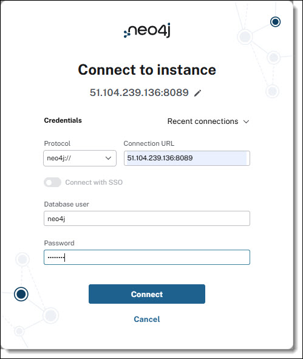

## Access Neo4j

To access Neo4j through the Browser UI from your local machine:
```
http://<server-ip>:<http-port>/browser/
```
**Example:**
```
http://viyaserver.mycomp.com:8080/browser/
```
#### Login Credentials
* **Username:** neo4j
* **Password:** Orion123
* **Connection URL:** Ensure the correct port is used


