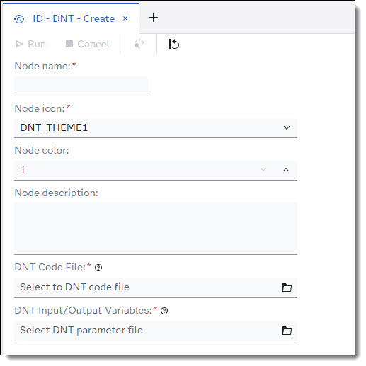

This custom step will install a DNT node into Intelligent Decissioning.

### Parameters

| Parameter | Comment |
| --- | --- |
| `Node name` | The name of the node. This name will be shown in Intelligent Decisioning. |
| `Node icon` | The node icon that is used on the canvas in Intelligent Decisioning. |
| `Node color` | The node color that is used for node on the canvas in Intelligent Decisioning. |
| `Node Description` | A brief text explaining what the node is doing. The description will be shown in Intelligent Decisioning |
| `DNT Code File` | The DS2 code body for the DNT|
| `DNT Input/Output Variables` | The input and output variables for the node. The variables need to be in JSON structure.|
