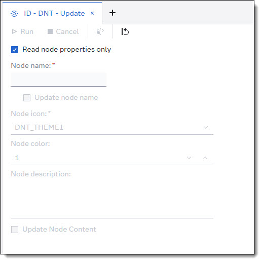

## Custom Step - DNT Update
This custom step will update an existing DNT node in Intelligent Decissioning.

### Parameters

| Parameter | Comment |
| --- | --- |
| Read node properties only | If ticked, the step will return the current settings for a DNT node in Intelligent Decisioning. The node will not be updated. Always read the node setting first before updating, to be aware of the current settings.|
| Node name | The name of the node to be updated. |
| Update node name | If ticked, the step will enable a field for a new name to change the node name in Intelligent Decisioning. |
| Node icon | The node icon that is used on the canvas in Intelligent Decisioning. |
| Node color | The node color that for the node used on the canvas in Intelligent Decisioning. |
| Node Description | A brief text explaining what the node is doing. The description will be shown in Intelligent Decisioning |
| Update node content | If ticked, the step will enable two fields to set *DNT Code File* and *DNT Input/Output Variables*. For more information see *DNT Create*. |