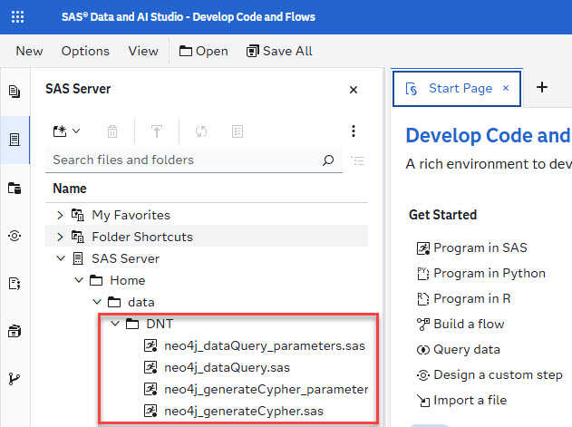
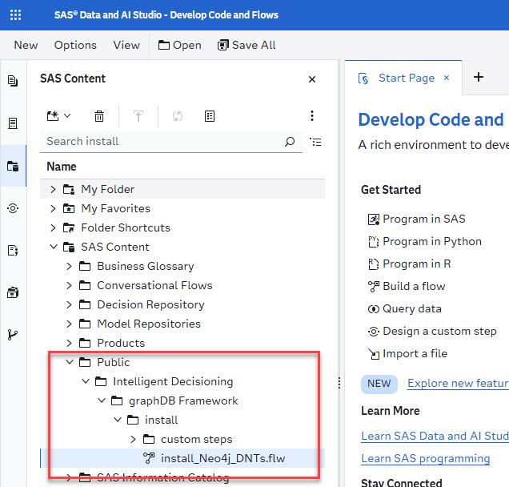
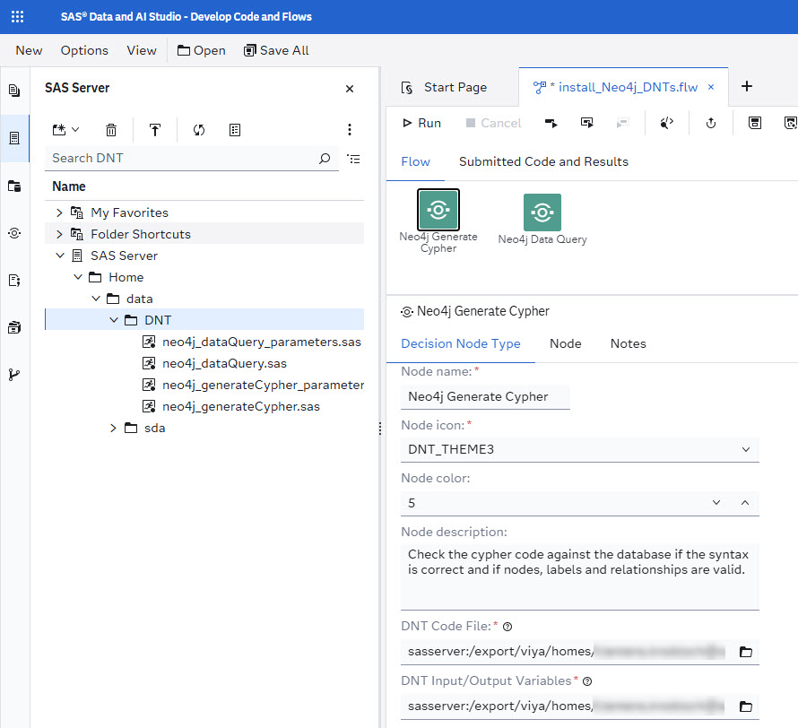
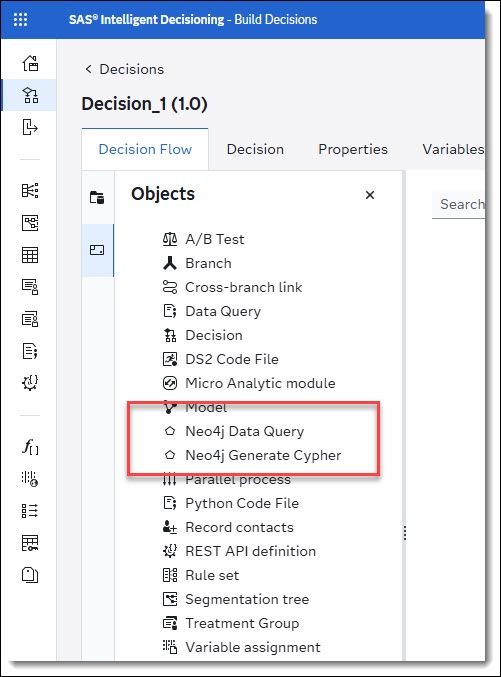

To install the ID-Neo4j nodes into Intelligent Decisioning via SAS Studio folow the steps below.

1. Download file [DNT_Custom_Steps.json](../../../data/custom_steps/DNT_Custom_Steps.json).
2. Import json file into SAS Viya.
    * This file will install custom steps to manage nodes in  Intelligent Decisioning and a studio flow to install the ID-Neo4j nodes.
3. Download [ID-Neo4j](../../../data/DNT/src/) node source files.
    * Download all files in the folder.
4. Go to SAS Studio
5. Create a new folder and upload ID-Neo4j source files into the folder
    

    
Upload ID-Neo4j source files

    
    

6. Open studio flow *install_Neo4j_DNTs.flw* in folder *SAS Content/Public/Intelligent Decisioning/graphDB Framework/install*.
    

    
install_Neo4j_DNTs.flw

    
    

7. Set DNT source code files.
    * In the studio flow set *DNT Code File* and DNT *Input/Output Variables* for the nodes *Neo4j Generate Cypher* and *Neo4j Data Query*.
    * **Neo4j Generate Cypher**
        * DNT Code File -> neo4j_generateCypher.sas
        * DNT Input/Output Variables -> neo4j_generateCypher_parameters.sas
    * **Neo4j Data Query**
        * DNT Code File -> neo4j_dataQuery.sas
        * DNT Input/Output Variables -> neo4j_dataQuery_parameters.sas
        

        
install_Neo4j_DNTs Flow

        
        

8. Run flow
    * This will install the nodes into Intelligent Decisoning

