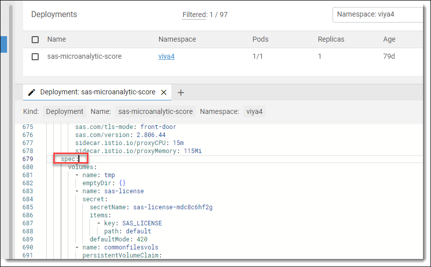
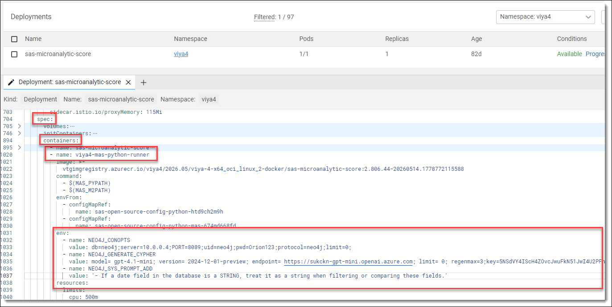

## MAS Configuration
For the decision flow to execute in MAS you need to set environment variable in MAS.
* Open **Lens**
* Go to **Deployments**
* Edit *sas-microanalytic-score*
* Go to section *spec*
    <details>
    <summary>section spec</summary>

    
    </details>
* In section *spec* look for container *viya4-mas-python-runner*
* Under container *viya4-mas-python-runner* look for section *env*<br>
If there is no section *env* add a section under *envFrom* and before *resources*.
    <details>
    <summary>section env</summary>

    
    </details>
* In section *env* add environment variables.

    **Example:**
    ```
    - name: NEO4J_CONOPTS
      value: db=neo4j;server=10.0.0.4;PORT=8089;uid=neo4j;pwd=Orion123;protocol=neo4j;limit=0;
    - name: NEO4J_GENERATE_CYPHER
      value: model= gpt-4.1-mini; version= 2024-12-01-preview; endpoint= https://sgerabc-gpt-mini.openai.azure.com; limit= 0; regenmax=3;key=<API_KEY>;
    - name: NEO4J_SYS_PROMPT_ADD
      value: '- If a date field in the database is a STRING, treat it as a string when filtering or comparing these fields.'
    ```
* Click on *Save and Close* button
    * This will automatically restart MAS.
