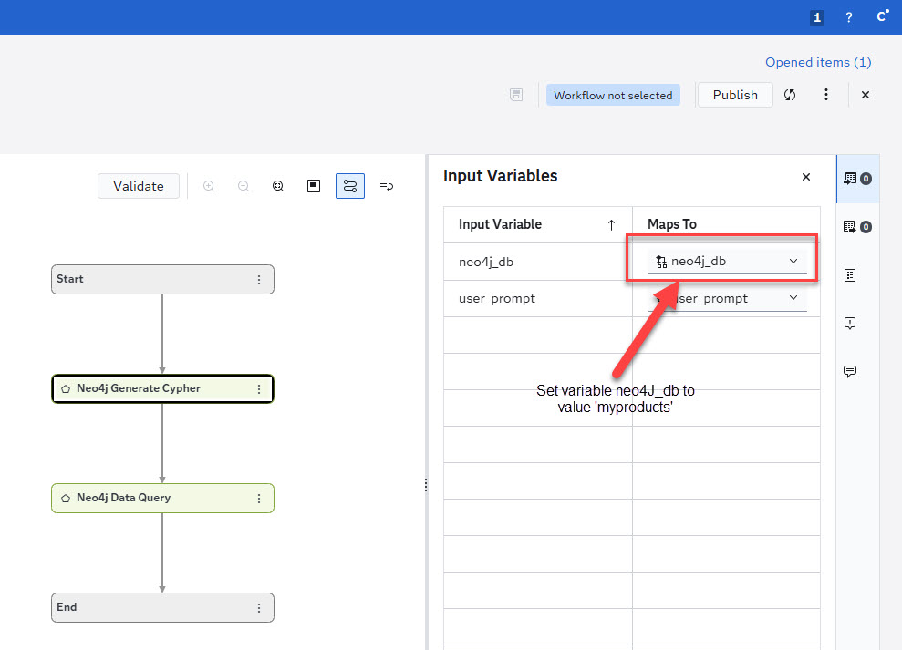

After installing the ID-Neo4j nodes, configure the connection parameters required for both the Neo4j database and the Large Language Model (LLM).

## Neo4j Database Parameters

Connection settings are provided through the environment variable `NEO4J_CONOPTS`.

| Parameter | Description |
|-----------|-------------|
| `db` | Name of the Neo4j database (case-sensitive) |
| `server` | Neo4j server hostname, URL, or IP address |
| `port` | Neo4j server port |
| `uid` | Neo4j username |
| `pwd` | Neo4j password |
| `protocol` | Connection protocol (`neo4j`, `neo4j+s`, `bolt`, `bolt+s`) |
| `limit` | Maximum number of records returned (`0` = unlimited, default: `0`) |

### Format

Parameters must be specified as key-value pairs separated by semicolons (`;`).

### Example

> **Note:** When working with multiple Neo4j databases, append the database name to the environment variable using an underscore (_).

**Example:**
Connection string for Neo4j database `MYPRODUCTS`
```
NEO4J_CONOPTS_MYPRODUCTS='db=myproducts;server=10.0.0.4;port=8089;uid=neo4j;pwd=Orion123;protocol=neo4j;limit=0;'
```
> **Important**: The environment variable name NEO4J_CONOPTS and any database-specific suffixes (for example, NEO4J_CONOPTS_MYPRODUCTS) must be defined in uppercase.


In the decision flow, set the input variable neo4j_db to the corresponding database identifier `neo4j_db = myproducts`




