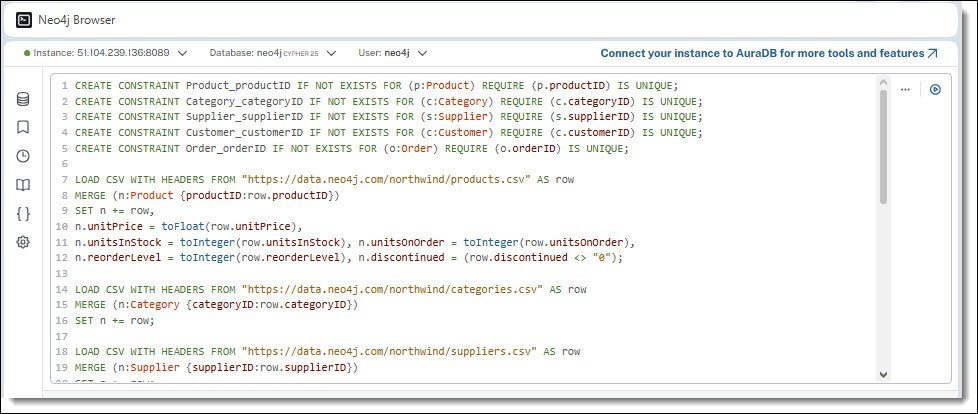
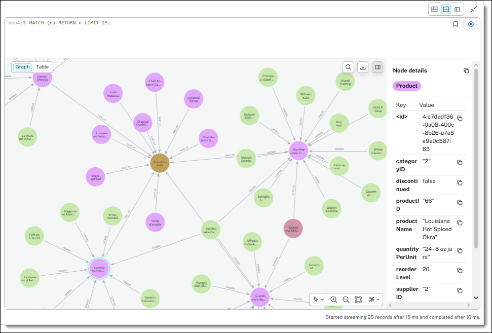

## Import Sample Data
To get started quickly, you can load the Neo4j **Northwind sample database**.

**Steps:**
* Navigate to the GitHub repository:

    https://github.com/neo4j-graph-examples/northwind
* Download the script:

    https://github.com/neo4j-graph-examples/northwind/blob/main/scripts/northwind.cypher
* Copy the script content into the Neo4j Browser Cypher editor and execute it

    This will install and populate the Northwind dataset.

Load Northwind data:

Loaded Northwind data in Neo4j:

