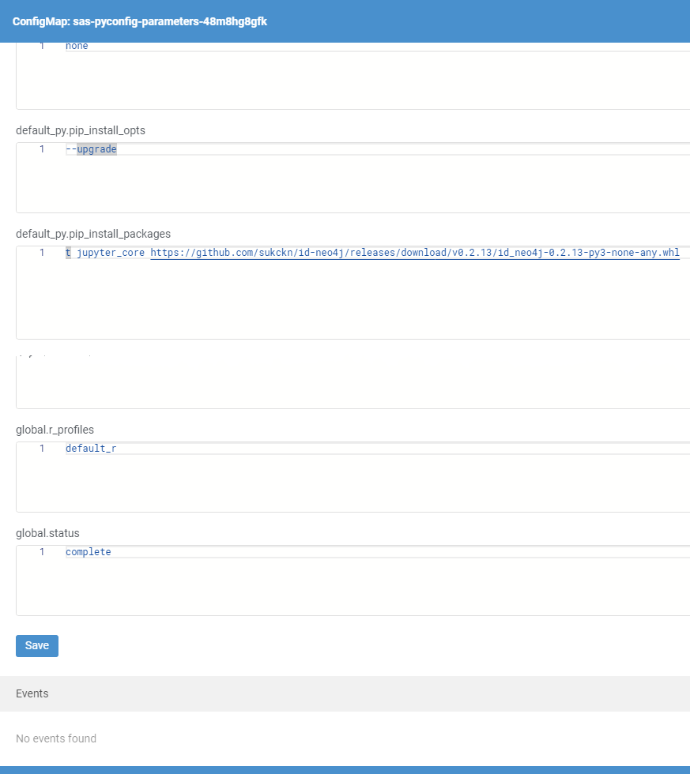
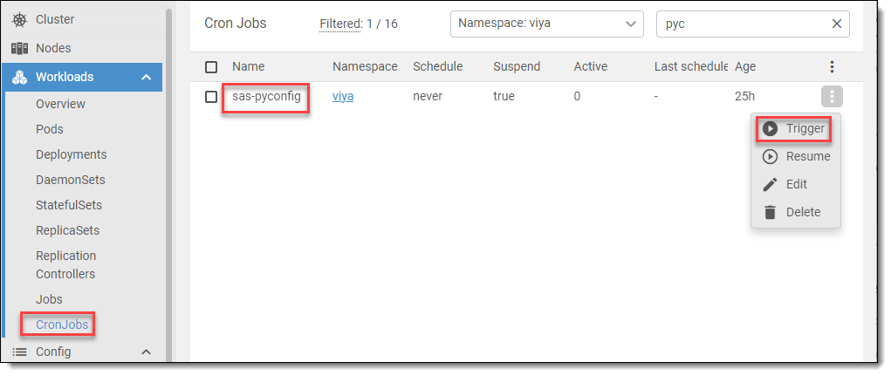

# Install Python Library

The Neo4j nodes rely on a Python library that must be added to the Viya Python environment.

* Open **Lens** and connect to your Kubernetes cluster.
* Navigate to **ConfigMaps** (Viya namespace).
* Select the ConfigMap starting with *sas-pyconfig-parameters*.
* Locate the property:
    ```
    default_py.pip_install_packages
    ```
* Add the following package to the end of the list (space-separated):
    ```
    https://github.com/sassoftware/sas-id-neo4j-extension/releases/download/v0.2.19/id_neo4j-0.2.19-py3-none-any.whl
    ```
    <details>
    <summary>Add Python library</summary>

    
    </details>

* Save changes.
* Navigate to *CronJobs*.
* Select *sas-pyconfig*.
* Trigger the *CronJob*.
    <details>
    <summary>Trigger Job</summary>

    
    </details>

    > 💡**Tip**: You can monitor the job in Pods. Look for a pod starting with *sas-pyconfig-manual* and check its logs.

### Validate the Installation
* Open **SAS Studio**
* Create a new Python script
* Run:
    ```
    import id_neo4j
    ```